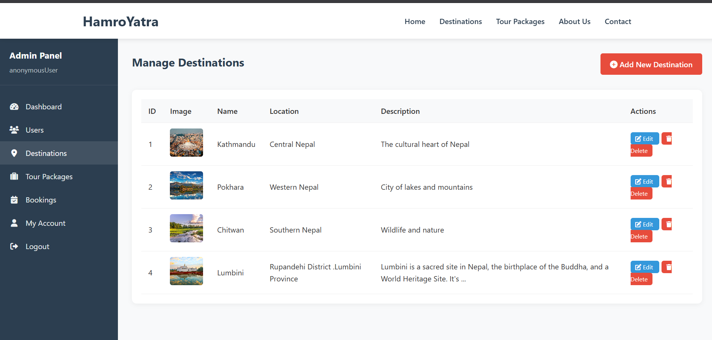
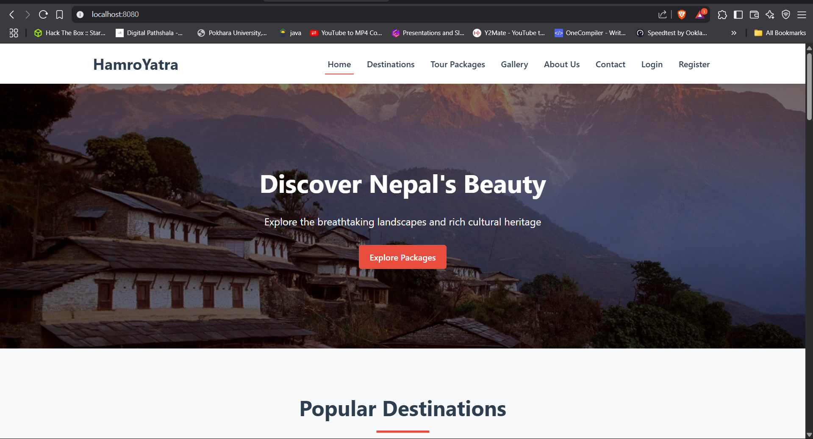
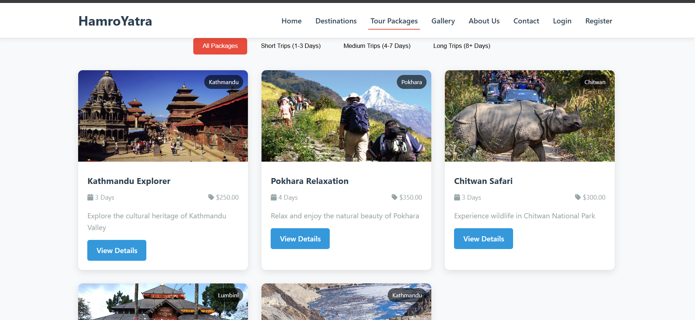
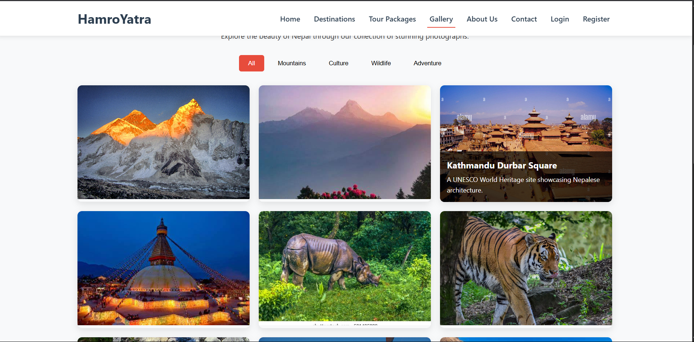
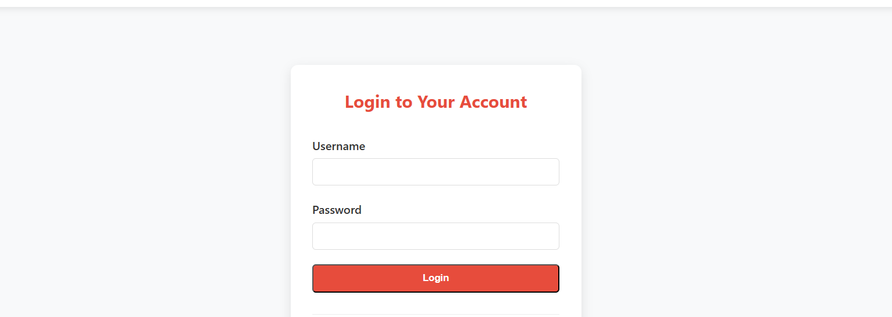
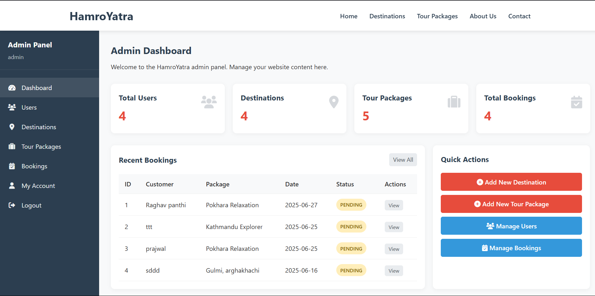
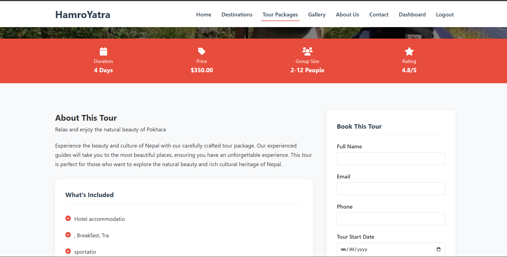

# HamroYatra

HamroYatra is a comprehensive travel and tour management platform for exploring Nepal. It features a Spring Boot backend and a Next.js frontend, providing booking, package management, user authentication, and more.

## Features

- Tour package listing and details
- Online booking system
- User registration and authentication
- Admin dashboard for managing packages, users, and bookings
- Gallery and contact pages
- Responsive design with Tailwind CSS

## Tech Stack

- **Backend:** Java, Spring Boot, Thymeleaf, JPA/Hibernate
- **Frontend:** Next.js, React, Tailwind CSS
- **Database:** MySQL (configurable)
- **Build Tools:** Maven, pnpm

## Project Structure

```
src/
├── main/
│   ├── java/
│   │   └── com/hamroyatra/
│   │       ├── config/       // Security & DB config
│   │       ├── controller/   // MVC Controllers
│   │       ├── model/        // JPA Entities
│   │       ├── repository/   // Spring Data interfaces
│   │       └── HamroYatraApplication.java
│   └── resources/
│       ├── static/          // CSS/JS assets
│       ├── templates/       // Thymeleaf HTML
│       └── application.properties
└── test/                    // Test cases
```

## Getting Started

### Prerequisites

- Java 17+
- Node.js 16+
- MySQL (or compatible database)
- Maven
- pnpm (or npm/yarn)

### Backend (Spring Boot)

1. **Configure Database:**
   - Edit `src/main/resources/application.properties` with your DB credentials.

2. **Build and Run:**
   ```sh
   cd HamroYatra
   mvn clean install
   mvn spring-boot:run
   ```

3. **Access:**
   - Visit [http://localhost:8080](http://localhost:8080)

### Frontend (Next.js)

1. **Install dependencies:**
   ```sh
   pnpm install
   ```

2. **Run the development server:**
   ```sh
   pnpm dev
   ```
   - Visit [http://localhost:8080](http://localhost:3000)

### Admin Access
 
- `/admin/login` for login
- Admin dashboard: `/admin`
- Default admin credentials: _Set up via database or registration (see code for details)_

## Folder Overview

- `src/main/java/com/hamroyatra/` - Java backend source code
- `src/main/resources/templates/` - Thymeleaf HTML templates
- `app/`, `components/`, `lib/` - Next.js frontend code

## Contributing

1. Fork the repo
2. Create your feature branch (`git checkout -b feature/fooBar`)
3. Commit your changes (`git commit -am 'Add some fooBar'`)
4. Push to the branch (`git push origin feature/fooBar`)
5. Create a new Pull Request

## License

[MIT](LICENSE)

## View Pages

Below are screenshots of the application views:

<p align="center">
  
  
  
  
  
  
  
</p>

---

For more details, see the code or open an issue!